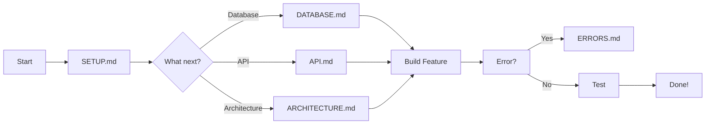

# 📚 SuperPet API - Documentation

Complete technical documentation for the SuperPet API multi-tenant SaaS platform.

---

## 🚀 Quick Start

New to the project? Start here:

1. **[Main README](../README.md)** - Project overview and features
2. **[SETUP.md](./guides/SETUP.md)** - Environment setup and first run
3. **[API.md](./guides/API.md)** - API endpoints reference
4. **[ARCHITECTURE.md](./guides/ARCHITECTURE.md)** - System design

---

## 📖 Documentation Structure

### 🎯 Core Guides (5 Files)

| Guide | Description | When to Read |
|-------|-------------|--------------|
| **[SETUP.md](./guides/SETUP.md)** | Environment, scripts, database seeding | First time setup |
| **[DATABASE.md](./guides/DATABASE.md)** | Schema, entities, migrations | Working with database |
| **[API.md](./guides/API.md)** | Complete endpoint reference + SaaS rules | Building features |
| **[ERRORS.md](./guides/ERRORS.md)** | Error codes, logging, business rules | Debugging/testing |
| **[ARCHITECTURE.md](./guides/ARCHITECTURE.md)** | System design, security, patterns | Understanding system |

---

## 📁 Complete File Tree

```
docs/
├── README.md (this file)
│
├── guides/ (5 comprehensive files)
│   ├── SETUP.md          ⭐ Environment + Scripts + Seeds
│   ├── DATABASE.md       ⭐ Migrations + Entities
│   ├── API.md            ⭐ 64 Endpoints + SaaS Rules
│   ├── ERRORS.md         ⭐ Error Codes + Logging
│   └── ARCHITECTURE.md   ⭐ System Design
│
└── collections/ (7 Postman collections)
    ├── auth/
    │   ├── README.md
    │   └── SuperPet-Auth.postman_collection.json (3 endpoints)
    ├── employees/
    │   ├── README.md
    │   └── SuperPet-Employees.postman_collection.json (10 endpoints)
    ├── stores/
    │   ├── README.md
    │   └── SuperPet-Stores.postman_collection.json (12 endpoints)
    ├── customers/
    │   ├── README.md
    │   └── SuperPet-Customers.postman_collection.json (11 endpoints)
    ├── pets/
    │   ├── README.md
    │   └── SuperPet-Pets.postman_collection.json (7 endpoints)
    ├── services/
    │   ├── README.md
    │   └── SuperPet-Services.postman_collection.json (13 endpoints)
    └── features/
        ├── README.md
        └── SuperPet-Features.postman_collection.json (8 endpoints)
```

---

## 🎯 By Use Case

### I want to...

#### **Get Started**
→ [SETUP.md](./guides/SETUP.md)
- Install dependencies
- Configure environment
- Run migrations
- Seed database
- Start API

#### **Understand the System**
→ [ARCHITECTURE.md](./guides/ARCHITECTURE.md)
- Multi-tenant design
- Security layers (JWT, RBAC)
- Role hierarchy
- Dynamic features
- Data flow

#### **Work with Database**
→ [DATABASE.md](./guides/DATABASE.md)
- Entity relationships
- Migration workflow
- Indexes strategy
- Multi-tenancy rules
- TypeORM configuration

#### **Build API Integrations**
→ [API.md](./guides/API.md)
- 64 documented endpoints
- Request/response examples
- Authentication flow
- SaaS isolation rules
- Plan limits

#### **Handle Errors**
→ [ERRORS.md](./guides/ERRORS.md)
- Error code reference (30+)
- Logging patterns
- Business rule validation
- Test error scenarios
- Debugging guide

#### **Test with Postman**
→ [collections/](./collections/)
- Import collection JSONs
- Pre-configured requests
- Auto-save tokens
- Error examples included

---

## 📊 Documentation Stats

| Metric | Count | Status |
|--------|-------|--------|
| **Core Guides** | 5 | ✅ Complete |
| **Postman Collections** | 7 | ✅ All endpoints |
| **Total Endpoints** | 64 | ✅ Documented |
| **Error Codes** | 30+ | ✅ Mapped |
| **Test Coverage** | 134 tests | ✅ 100% pass |
| **Language** | English | ✅ Professional |

---

## 🗺️ Documentation Map

### For Developers



### For API Consumers

```
1. Auth (collections/auth/)
   ↓
2. Create Resources (collections/employees|stores|customers|pets/)
   ↓
3. Manage Services (collections/services/)
   ↓
4. Use Features (collections/features/)
```

---

## 🎓 Learning Path

### Day 1: Setup & Basics
1. Read [Main README](../README.md) - 10 min
2. Follow [SETUP.md](./guides/SETUP.md) - 30 min
3. Import [Auth collection](./collections/auth/) - 5 min
4. Test endpoints in Postman - 15 min

**Time:** ~1 hour | **Goal:** API running + basic auth

### Day 2: Architecture & Database
1. Read [ARCHITECTURE.md](./guides/ARCHITECTURE.md) - 30 min
2. Read [DATABASE.md](./guides/DATABASE.md) - 30 min
3. Explore entities in `src/*/entities/` - 30 min

**Time:** ~1.5 hours | **Goal:** Understand system design

### Day 3: API Integration
1. Read [API.md](./guides/API.md) - 45 min
2. Import all [Postman collections](./collections/) - 10 min
3. Test workflows in Postman - 45 min

**Time:** ~1.5 hours | **Goal:** Integrate with API

### Day 4: Error Handling & Testing
1. Read [ERRORS.md](./guides/ERRORS.md) - 30 min
2. Run [automation tests](../test/automation/README.md) - 30 min
3. Review logs in API terminal - 15 min

**Time:** ~1 hour | **Goal:** Handle errors properly

**Total Learning Time:** ~5 hours for complete understanding ✅

---

## 🔍 Finding What You Need

### Search by Topic

| Topic | File(s) |
|-------|---------|
| **Authentication** | API.md (Auth section) |
| **Authorization** | ARCHITECTURE.md (Security layers) |
| **Employees & Roles** | API.md + ARCHITECTURE.md |
| **Multi-tenancy** | ARCHITECTURE.md + DATABASE.md |
| **Stores & Features** | API.md |
| **Customers & Pets** | API.md |
| **Services Catalog** | API.md |
| **Migrations** | DATABASE.md + SETUP.md |
| **Environment Setup** | SETUP.md |
| **Error Handling** | ERRORS.md |
| **Business Rules** | ERRORS.md |
| **Testing** | ERRORS.md + test/automation/README.md |

### Search by HTTP Status

| Status | Guide | Section |
|--------|-------|---------|
| **401** | ERRORS.md | Authentication Errors |
| **403** | ERRORS.md | Authorization Errors |
| **400** | ERRORS.md | Validation Errors |
| **404** | ERRORS.md | Not Found |

### Search by Feature

| Feature | Guide | Postman |
|---------|-------|---------|
| **TelePickup** | API.md | collections/features/ |
| **Live Camera** | API.md | collections/features/ |
| **Dynamic Features** | ARCHITECTURE.md | collections/stores/ |
| **Plan Limits** | ARCHITECTURE.md + ERRORS.md | N/A |
| **Custom Pricing** | API.md | collections/services/ |

---

## 📝 Documentation Standards

### Formatting
- **Headers:** Title case with emoji
- **Code blocks:** Always specify language
- **Links:** Relative paths within repo
- **Tables:** For structured data
- **Examples:** Inline for clarity

### Language
- ✅ English (professional)
- ✅ Clear and concise
- ✅ Active voice
- ✅ Technical but accessible
- ❌ No jargon without explanation

### Structure
- Table of contents for long docs
- Quick reference at top
- Examples throughout
- Related docs at bottom
- Emoji for visual scanning

---

## 🛠️ Maintaining Documentation

### When to Update

- ✅ New feature added → Update API.md + Postman
- ✅ New error code → Update ERRORS.md
- ✅ Database schema change → Update DATABASE.md
- ✅ New environment variable → Update SETUP.md
- ✅ Architecture change → Update ARCHITECTURE.md

### Pull Request Checklist

When submitting code changes:

- [ ] Updated relevant guide(s)
- [ ] Added Postman examples (if API change)
- [ ] Updated error codes (if new error)
- [ ] Updated test documentation
- [ ] Verified all links work
- [ ] No broken references

---

## 💡 Tips & Tricks

### For Developers

**Use Postman Collections:**
- Import all 7 collections at once
- Collections auto-save tokens
- Pre-configured with error examples

**Watch API Logs:**
```bash
npm run start:local
# See business rule logs, plan limits, role checks
```

**Test Error Scenarios:**
```bash
npm run test:automation:all
# See all error codes in action
```

### For API Consumers

**Start with Auth:**
1. Import Auth collection
2. Register → Get token
3. Save token (auto-saved)
4. Use in other collections

**Understand Errors:**
- `404` = Resource doesn't exist (or cross-tenant)
- `403` = You don't have permission
- `400` = Validation error
- `401` = Token missing/invalid

**Check Plan Limits:**
- FREE: 1 store, 5 employees
- BASIC: 3 stores, 20 employees
- PRO: 10 stores, 50 employees
- ENTERPRISE: Unlimited

---

## 📞 Getting Help

### Documentation Issues

- **Broken link?** → Check [this file](./README.md)
- **Unclear explanation?** → See [ARCHITECTURE.md](./guides/ARCHITECTURE.md)
- **Missing info?** → Check [API.md](./guides/API.md)

### Technical Issues

- **Setup problems?** → [SETUP.md](./guides/SETUP.md) troubleshooting
- **Database errors?** → [DATABASE.md](./guides/DATABASE.md) migration guide
- **API errors?** → [ERRORS.md](./guides/ERRORS.md) error reference
- **Test failures?** → [test/automation/README.md](../test/automation/README.md)

---

## ✨ What's New

**Recent Updates:**
- ✅ Consolidated 28 → 8 markdown files (-71%)
- ✅ Created 5 comprehensive guides
- ✅ All documentation in English
- ✅ Professional formatting throughout
- ✅ Complete Postman collection coverage
- ✅ 88 automated tests documented

**Latest Updates:**
- ✅ 134+ automated tests with 100% pass rate
- ✅ All collections updated (no /v1 prefix)
- ✅ SaaS feature division implemented
- ✅ Complete API documentation
- ✅ Error handling guide

---

<div align="center">

### 🎯 Everything you need in 5 comprehensive guides!

**[SETUP](./guides/SETUP.md)** | **[DATABASE](./guides/DATABASE.md)** | **[API](./guides/API.md)** | **[ERRORS](./guides/ERRORS.md)** | **[ARCHITECTURE](./guides/ARCHITECTURE.md)**

**Documentation is production-ready!** ✨

</div>
